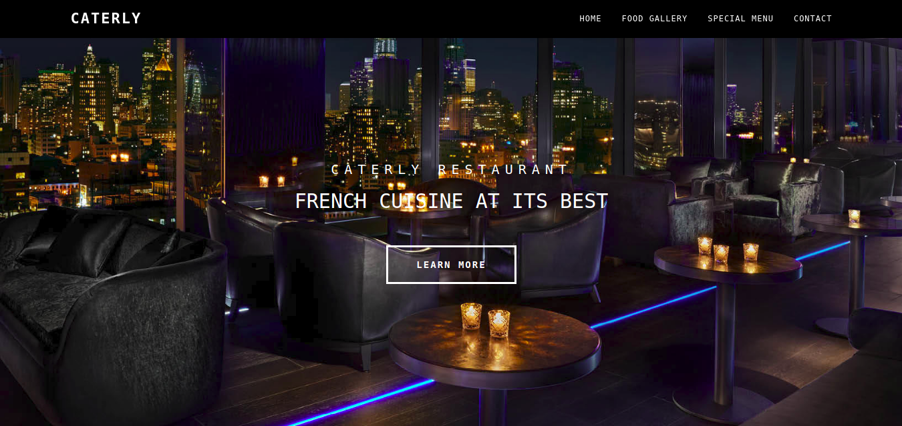

# Restaurant-Page - [Microverse - JavaScript Course]

> ​  We are going to be using only JavaScript to generate the entire content of a restaurant page!.



Additional description about the project and its features.

## Link to Project
[OdinProject](https://www.theodinproject.com/courses/javascript/lessons/restaurant-page)

## Built With

- HTML/CSS,
- Javascript,
- Webpack

## Live Demo

[Live Demo Link](https://rawcdn.githack.com/damiecode/Restaurant-Page/77bf25f144f23c3e09cfadf76c6dd9d7c8c9059f/dist/index.html )


## Getting Started

To get a local copy up and running follow these simple example steps.

### Setup

Open your git bash and cd to the location you'd like to put your files the run the command below.

```console
git clone https://github.com/damiecode/Restaurant-Page.git
```

## Installation

Install NPM dependecies.

```bash
npm install
```

## Dependencies

```
file-loader
style-loader
css-loader
webpack
webpack-cli
```

## Author

👤 **Damilola Ale**

- Email: _codenlyn@gmail.com_
- Github: [@damiecode](https://github.com/damiecode)
- Linkedin: [Damilola Ale](https://linkedin.com/in/damiecode/)

## Show your support

Give a ⭐️ if you like this project!
